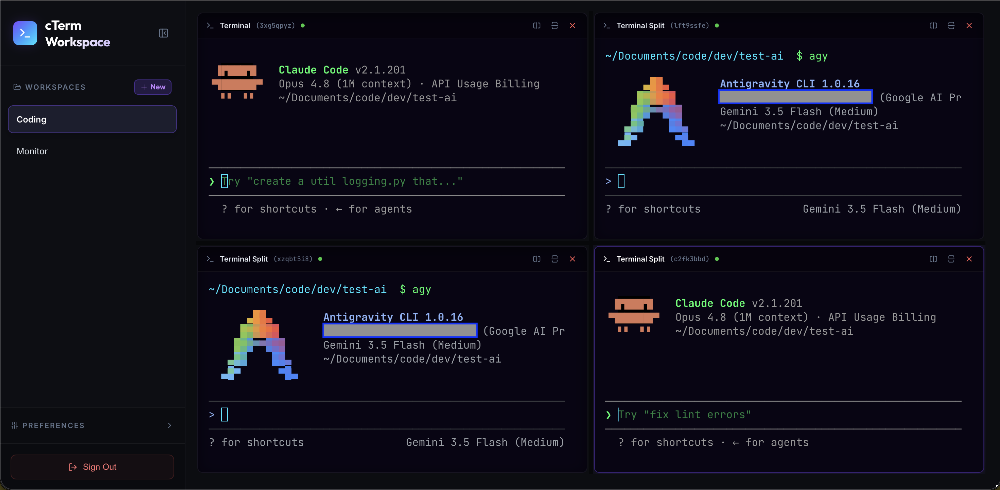

# cTerm - Web-Based Terminal Workspace Manager

A full-stack Node.js and React application featuring real-time, interactive terminal sessions on the frontend using **xterm.js** and **node-pty** on the backend over **WebSockets**, secured with **session-token authentication**.

cTerm provides an ideal sandbox dashboard, making it highly effective for running, monitoring, and debugging **multiple concurrent autonomous AI agents** in side-by-side terminal sessions.



## Features

- 🤖 **AI Agent Orchestration**: Run, monitor, and interact with multiple autonomous AI agents simultaneously in side-by-side terminal panes.
- 🖥️ **Real-Time Shell Access**: Run actual system shell sessions (`zsh`/`bash` depending on host OS) directly in your browser.
- 🔐 **Token-Based Authentication**: Secure access protected by custom credentials set in environment variables (`AUTH_USERNAME`, `AUTH_PASSWORD`).
- 🚪 **Sleek Glassmorphic Login**: A premium login card with radial back-gradient, input glow triggers, and active sign-in alerts.
- 📤 **Single-Click Sign Out**: Dedicated logout action button in the sidebar header to easily clear authentication states.
- 🗂️ **IDE-Grade Workspaces**: Create, rename, and manage multiple workspaces. Each workspace acts as an independent canvas containing its own layout of terminals.
- 🥞 **Multi-Pane Split Layouts**: Split any active terminal pane **horizontally** or **vertically** to create multi-session grid views.
- 🎚️ **Interactive Resizing**: Drag the split dividers in real-time to adjust pane dimensions.
- 🫳 **Drag & Drop Re-arrangement**: Drag a terminal header and drop it on another pane to instantly swap their session locations.
- 🔄 **State Persistence**: Reconnect to active shells automatically. The workspace layout and division structures are persisted in `localStorage`, meaning refreshes or restarts preserve your exact layout and backend shell history.
- 🎨 **Appearance Controls**: Switch themes (Dracula, Nord, Cyberpunk, One Dark, Light), adjust font sizes (12px to 20px), toggle cursor blinking, and select cursor style (Block, Underline, Bar) in real-time.
- 💎 **Premium Dashboard Styling**: Modern interface with glassmorphic elements, neon cues, and smooth transitions.

---

## Tech Stack

- **Backend**: Node.js, Express, `ws` (WebSockets), `node-pty` (Native pseudoterminal wrapper), `dotenv`
- **Frontend**: React, Vite, `@xterm/xterm` (core terminal emulator), `@xterm/addon-fit` (resizing helper), `@xterm/addon-web-links` (hyperlink support), `lucide-react` (icons)

---

## Getting Started

### Prerequisites

Make sure you have Node.js (v18+) and npm installed. Since `node-pty` compiles native code, you should have basic build tools installed:
- **macOS**: Xcode Command Line Tools (run `xcode-select --install`)
- **Windows**: Build tools (run `npm install --global windows-build-tools` from admin shell)
- **Linux**: Python, make, and g++ (e.g., `sudo apt install build-essential python3`)

### Installation & Run

1. **Install all dependencies** (for root, server, and client):
   ```bash
   npm run install:all
   ```

2. **Configure Environment Variables**:

   For server, `server/env_example` has example configuration:
   - `PORT=3001`
   - `AUTH_USERNAME=admin`
   - `AUTH_PASSWORD=admin`
   
   to use this just copy the file to .env in the server folder.

   For client, `client/env_example` has example configuration:
   - `VITE_BACKEND_HOST=0.0.0.0`
   - `VITE_BACKEND_PORT=3001`

   to use this just copy the file to .env in the client folder.

3. **Start the development servers concurrently**:
   ```bash
   npm run dev
   ```
   Open your browser to the URL shown by Vite (typically [http://localhost:5173](http://localhost:5173)).

4. **Production Build & Launch**:
   Compile the frontend assets into production bundles:
   ```bash
   npm run build
   ```
   Start the production server (which runs the backend API and serves the compiled static client assets concurrently):
   ```bash
   npm start
   ```
   Navigate your browser to [http://localhost:3001](http://localhost:3001) (or the custom `PORT` set in `server/.env`).

5. Sign in with the credentials configured in `server/.env` (default is **admin / admin**).

---

## Workspace Layout & Protocol Design

The frontend layout is modeled as a recursive binary split tree. Workspaces preserve this tree structure, identifying terminal nodes by their session IDs:

```json
{
  "id": "ws-12345",
  "name": "Development Workspace",
  "layout": {
    "id": "split-horizontal-root",
    "type": "split",
    "direction": "horizontal",
    "sizes": [40, 60],
    "children": [
      {
        "id": "pane-left",
        "type": "terminal",
        "sessionId": "session-a1b2c3d4",
        "title": "Local Shell"
      },
      {
        "id": "split-vertical-right",
        "type": "split",
        "direction": "vertical",
        "sizes": [50, 50],
        "children": [
          { "id": "pane-top-right", "type": "terminal", "sessionId": "session-x5y6z7", "title": "Dev Logs" },
          { "id": "pane-bottom-right", "type": "terminal", "sessionId": "session-m9n8p7", "title": "Database CLI" }
        ]
      }
    ]
  }
}
```

The WebSocket server expects and delivers JSON payloads to distinguish data streams:

#### Keystroke Input (Client ➔ Server)
```json
{
  "type": "input",
  "data": "ls\r"
}
```

#### Terminal Resizing (Client ➔ Server)
```json
{
  "type": "resize",
  "cols": 98,
  "rows": 32
}
```

#### Terminal Output (Server ➔ Client)
```json
{
  "type": "output",
  "data": "file1.txt  file2.js  node_modules\r\n"
}
```

#### Buffer Restore (Server ➔ Client on attachment)
```json
{
  "type": "restore",
  "data": "...[last 1000 lines of terminal output]..."
}
```
